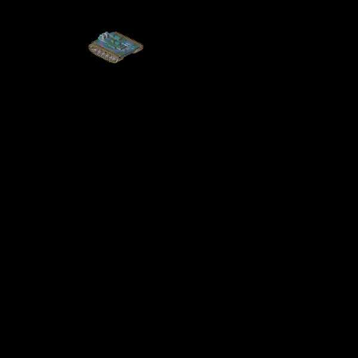



## Movement

### Description

This code shows how to move an object along exact angles using trigonometry. I made it after I download a sprite that could face 32 different directions. Instead of doing some complex movement function like I'd done before, I made this technique. Now all I had to do was increment a variable by 11.25 (360/32)

I am sure that I am not the first at doing this, it's just that I had never seen it on the internet before so I thought I would put it up and help all of those who could use it. I just put it into a simple project where you drive a tank around.

The project could be used for a game too, if you want, e-mail me and I will send you the better graphics, the ones I used are shrunk and 8-bit instead of 24.

Anyways, download the code and enjoy, all feedback is welcome.
 
### More Info
 

             |
---                |---
**Submitted On**   |2000-07-05 14:06:10
**By**             |[Chad Bjorklund](https://github.com/Planet-Source-Code/PSCIndex/blob/master/ByAuthor/chad-bjorklund.md)
**Level**          |Beginner
**User Rating**    |4.2 (21 globes from 5 users)
**Compatibility**  |VB 3\.0, VB 4\.0 \(16\-bit\), VB 4\.0 \(32\-bit\), VB 5\.0, VB 6\.0, VB Script, ASP \(Active Server Pages\) 
**Category**       |[Miscellaneous](https://github.com/Planet-Source-Code/PSCIndex/blob/master/ByCategory/miscellaneous__1-1.md)
**World**          |[Visual Basic](https://github.com/Planet-Source-Code/PSCIndex/blob/master/ByWorld/visual-basic.md)
**Archive File**   |[CODE\_UPLOAD7459752000\.zip](https://github.com/Planet-Source-Code/chad-bjorklund-movement__1-9530/archive/master.zip)

